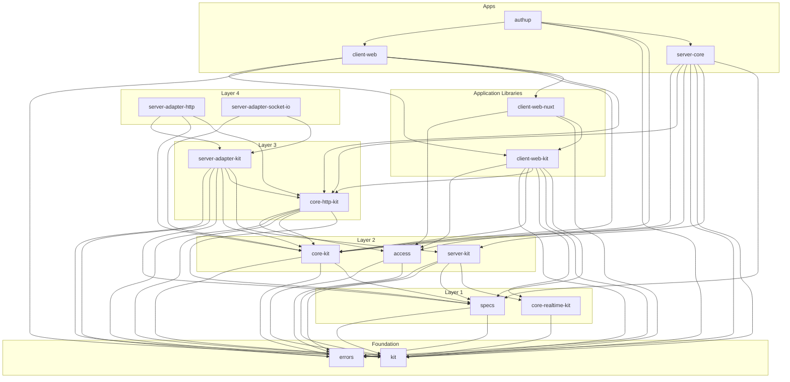

# Package Dependency Graph

<!-- This file is auto-generated. Update it by running /update-dependency-graph -->

```mermaid
graph TD
    subgraph Foundation
        kit
        errors
    end

    subgraph Layer 1
        specs
        core-realtime-kit
    end

    subgraph Layer 2
        access
        core-kit
        server-kit
    end

    subgraph Layer 3
        core-http-kit
        server-adapter-kit
    end

    subgraph Layer 4
        server-adapter-http
        server-adapter-socket-io
    end

    subgraph Application Libraries
        client-web-kit
        client-web-nuxt
    end

    subgraph Apps
        server-core
        client-web
        authup
    end

    %% Foundation has no internal deps

    %% Layer 1
    specs --> kit
    specs --> errors
    core-realtime-kit --> kit

    %% Layer 2
    access --> kit
    access --> errors
    core-kit --> kit
    core-kit --> errors
    core-kit --> specs
    server-kit --> kit
    server-kit --> errors
    server-kit --> specs
    server-kit --> core-realtime-kit

    %% Layer 3
    core-http-kit --> access
    core-http-kit --> errors
    core-http-kit --> kit
    core-http-kit --> core-kit
    core-http-kit --> specs
    server-adapter-kit --> kit
    server-adapter-kit --> errors
    server-adapter-kit --> specs
    server-adapter-kit --> core-kit
    server-adapter-kit --> core-http-kit
    server-adapter-kit --> server-kit

    %% Layer 4
    server-adapter-http --> server-adapter-kit
    server-adapter-http --> core-kit
    server-adapter-http --> core-http-kit
    server-adapter-socket-io --> core-kit
    server-adapter-socket-io --> server-adapter-kit

    %% Application Libraries
    client-web-kit --> access
    client-web-kit --> kit
    client-web-kit --> core-kit
    client-web-kit --> core-http-kit
    client-web-kit --> core-realtime-kit
    client-web-kit --> errors
    client-web-kit --> specs
    client-web-nuxt --> access
    client-web-nuxt --> kit
    client-web-nuxt --> client-web-kit

    %% Apps
    server-core --> access
    server-core --> core-http-kit
    server-core --> core-kit
    server-core --> errors
    server-core --> kit
    server-core --> server-kit
    server-core --> specs
    client-web --> client-web-kit
    client-web --> kit
    client-web --> core-kit
    client-web --> core-http-kit
    client-web --> client-web-nuxt
    authup --> client-web
    authup --> kit
    authup --> core-kit
    authup --> server-core
```
