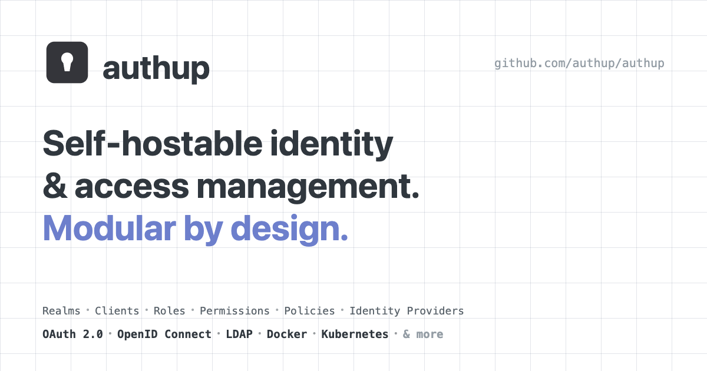

<div align="center">

[](https://authup.org)

</div>

[](https://github.com/authup/authup/actions/workflows/main.yml)
[](https://snyk.io/test/github/authup/authup)
[](https://conventionalcommits.org)
[](https://github.com/authup/authup/blob/master/LICENSING.md)
[](https://github.com/authup/authup)
[](https://doi.org/10.5281/zenodo.20836542)

## What is Authup?
Authup is an authentication & authorization system.
It is designed to be easy to use and flexible, with support for multiple authentication strategies.
With Authup, developers can quickly and easily add authentication & authorization to their applications.

**Table of Contents**

- [Features](#features)
- [Documentation](#documentation)
- [Usage](#usage)
  - [Quick Start](#quick-start)
  - [Production](#production)
  - [Development](#development)
- [Applications](#applications)
- [Packages](#packages)
- [Contributing](#contributing)
- [Citation](#citation)
- [License](#license)

## Features

- 🌐 **Integration** - Easy integration into existing systems and only use the components you need
- 🛡️ **Identity- & Access-Management** - Manage user identities and control access to resources
- 🏭 **Clustering** - Cluster and scale authup for high availability and performance with Docker/Kubernetes
- ⚡  **Blazing Fast** - Fast and reliable system due to microservice architecture
- ️‍️🕵️‍♀️ **Logging & Monitoring** - Logs and monitors activities and transactions to detect potential security issues
- 👤 **Single-Sign On** - Login once to multiple applications
- 📜 **Standard Protocols** - [LDAP](https://datatracker.ietf.org/doc/html/rfc4511), [OAuth2.0](https://tools.ietf.org/html/rfc6749) & [OpenID Connect](https://openid.net/connect/)
- 👍 **Social Login** - Easy enable social login (GitHub, Google, Facebook, ...)
- 🤝 **Identity Brokering** - OpenID Connect
- 🔓 **Simple claim based** and fully featured **subject and attribute based** authorization
- 🧩 **Isomorphic** & **declarative** permission management. Serialize and share permissions between UI, API & microservices
- 💻 **TypeScript** and **JavaScript** support
- 📚 **Client** libraries
- & much **more**

## Documentation

To read the docs, visit [https://authup.org](https://authup.org)

## Usage

How Authup can be configured and set up in detail, you can find out [here](https://authup.org/guide/deployment/).

### Quick Start

The fastest way to try Authup out is the global CLI. It needs no configuration:

```shell
$ npx authup@latest start
```

With no database configured, Authup falls back to SQLite and writes `db.sqlite`
into the current working directory. That is meant for trying things out and for
local development. It is not a production setup.

It serves:
- API: `http://localhost:3000/`
- Auth console (login, consent, register, password recovery): served under `http://localhost:3000/console/auth/`
- Admin console: `http://localhost:3000/console/admin`
- Account console: `http://localhost:3000/console/account`

To find out how to configure and set up the bare metal variant in detail, click
[here](https://authup.org/guide/deployment/bare-metal).

### Production

The **recommended** and optimal way to set up authup is using docker.
One container runs the whole deployment against a PostgreSQL or MySQL database you already have.

```shell
$ docker run \
  -p 3000:3000 \
  -e PUBLIC_URL=http://localhost:3000 \
  -e DB_TYPE=postgres \
  -e DB_HOST=postgres.example.com \
  -e DB_PORT=5432 \
  -e DB_USERNAME=authup \
  -e DB_PASSWORD=secret \
  -e DB_DATABASE=authup \
  authup/authup:latest start
```

The image runs in production mode, which does not support SQLite, so it does not start until a server database is configured, via `DB_*` or a `db:` block in `authup.yml`.

It serves:
- API: `http://localhost:3000/`
- Auth console (login, consent, register, password recovery): served under `http://localhost:3000/console/auth/`
- Admin console: `http://localhost:3000/console/admin`
- Account console: `http://localhost:3000/console/account`

For the full setup, including a compose file that brings the database with it, see the [deployment guide](https://authup.org/guide/deployment/).

Rather than writing those files by hand, run `npm create authup@latest`: a few
prompts write a compose project, helm values, a `docker run` env file or a
bare-metal project, with the image tag and the npm range pinned to the release.

### Development

Install the workspace dependencies, build once, and start the unified development
loop:

```shell
$ npm i
$ npm run build
$ npm run dev
```

This runs the experimental `authup dev` command: server-core and every console
share `http://localhost:3000/`, the consoles use hot module replacement, and
server-core runs directly from TypeScript source.

To work on the admin console against a standalone dev server instead, start it in
a second terminal:

```shell
$ VITE_API_URL=http://localhost:3000 npm run dev --workspace=apps/client-admin-console
```

It listens on `http://localhost:5173/console/admin/`.

## Applications
The repository contains the following application workspaces:

| Name | Type | Description |
|---|---|---|
| [authup](apps/authup) | CLI | The operator binary. It composes the core and enabled console services in one process and provides the `start`, `migration`, `healthcheck`, and `config` commands. |
| [client-account-console](apps/client-account-console) | Bundle | The end-user self-service SPA, served by `server-account-console` or hosted as static files. |
| [client-admin-console](apps/client-admin-console) | Bundle | The administration SPA, served by `server-admin-console` or hosted as static files. |
| [client-auth-console](apps/client-auth-console) | Bundle | The server-rendered login, consent, registration, and account-recovery UI rendered by `server-auth-console`. |
| [server-account-console](apps/server-account-console) | Service | Serves the account console bundle with runtime configuration and theming. |
| [server-admin-console](apps/server-admin-console) | Service | Serves the admin console bundle with runtime configuration and theming. |
| [server-auth-console](apps/server-auth-console) | Service | Renders the hosted auth workflow pages on the identity-provider origin. |
| [server-core](apps/server-core) | Service | Provides the OAuth2/OpenID Connect endpoints and management API; it renders no console and ships no binary. |

## Packages
The repository contains the following packages:

| Name | Description |
|---|---|
| [access](packages/access) | Permission and policy evaluation. |
| [client-web-kit](packages/client-web-kit) | Reusable Vue components, composables, and web utilities. |
| [client-web-kit-theme](packages/client-web-kit-theme) | Base vuecs theme and component styles for `client-web-kit`. |
| [client-web-nuxt](packages/client-web-nuxt) | Nuxt integration for Authup web clients. |
| [client-web-theme](packages/client-web-theme) | Authup's application theme for vuecs components. |
| [core-http-kit](packages/core-http-kit) | HTTP client and resource APIs for Authup. |
| [core-kit](packages/core-kit) | Shared core constants, types, and utilities. |
| [core-realtime-kit](packages/core-realtime-kit) | Toolkit for Authup realtime clients. |
| [errors](packages/errors) | Shared error codes and error classes. |
| [i18n](packages/i18n) | Framework-agnostic translations and locale registry. |
| [kit](packages/kit) | General context-independent utilities. |
| [server-adapter-kit](packages/server-adapter-kit) | Shared token verification, caching, and types for server adapters. |
| [server-adapter-node](packages/server-adapter-node) | Node.js request middleware for token verification. |
| [server-adapter-socket-io](packages/server-adapter-socket-io) | Socket.IO middleware for token verification. |
| [server-adapter-web](packages/server-adapter-web) | Web `Request` adapter primitive for token verification. |
| [server-config](packages/server-config) | The complete declarative `authup.yml` configuration registry. |
| [server-config-kit](packages/server-config-kit) | Configuration registries, environment readers, validation, defaults, and JSON Schema generation. |
| [server-console-kit](packages/server-console-kit) | Shared console-serving, security-header, asset, shell, and theming mechanisms. |
| [server-kit](packages/server-kit) | Shared server-side contracts and utilities. |
| [server-test-kit](packages/server-test-kit) | Shared test fakes for server packages and applications. |
| [specs](packages/specs) | Constants, types, and utilities for supported specifications. |

## Contributing

Before starting to work on a pull request, it is important to review the guidelines for
[contributing](./CONTRIBUTING.md) and the [code of conduct](./CODE_OF_CONDUCT.md).
These guidelines will help to ensure that contributions are made effectively and are accepted.

## Comparison

|                                                 | Authup | Keycloak | Authentic | Authelia |
|:------------------------------------------------|:------:|:--------:|:---------:|:--------:|
| Realm Resources (User, Roles, Permissions, ...) |   ✓    |    ✓     |     ✗     |    ✗     |
| Global Resources (Roles, Permissions, ...)      |   ✓    |    ✗     |     ✓     |    ✓     |
| Modular System                                  |   ✓    |    ✗     |     ✓     |    ✗     |
| Client Library                                  |   ✓    |    ✓     |     ✓     |    ✗     |
| Vue.JS Library                                  |   ✓    |    ✗     |     ✗     |    ✗     |
| OAuth2 Protocol                                 |   ✓    |    ✓     |     ✓     |    ✓     |
| OpenID Connect Protocol                         |   ✓    |    ✓     |     ✓     |    ✓     |
| LDAP Protocol                                   |   ✓    |    ✗     |     ✓     |    ✓     |


## Citation

If you use Authup in academic work, please cite it. Citation metadata is maintained in
[`CITATION.cff`](./CITATION.cff) — GitHub renders a **"Cite this repository"** button from it.

Authup is archived on [Zenodo](https://doi.org/10.5281/zenodo.20836542), which mints a DOI for
each release. The badge below resolves to the **concept DOI** — it always points to the latest
version; to cite a specific release, use that version's DOI from the
[Zenodo record](https://doi.org/10.5281/zenodo.20836542).

[](https://doi.org/10.5281/zenodo.20836542)

Example (BibTeX):

```bibtex
@software{placzek_authup,
  author    = {Placzek, Peter},
  title     = {Authup},
  url       = {https://github.com/authup/authup},
  doi       = {10.5281/zenodo.20836542},
  publisher = {Zenodo}
}
```

## License

Made with 💚

Authup is dual-licensed:

- All **applications** under [apps/](apps) — the CLI, core and console services,
  and client bundles — are published under the [AGPL-3.0](./LICENSE). A
  commercial license is available for organizations that cannot meet the AGPL's
  conditions.
- All **packages** under [packages/](packages) (client libraries, SDKs, server adapters, shared kits)
  remain under the permissive [Apache 2.0 License](packages/kit/LICENSE) — integrating your own
  application with an Authup server never subjects it to the AGPL.

See [LICENSING.md](./LICENSING.md) for details, or contact **contact@tada5hi.net** for commercial licensing.
